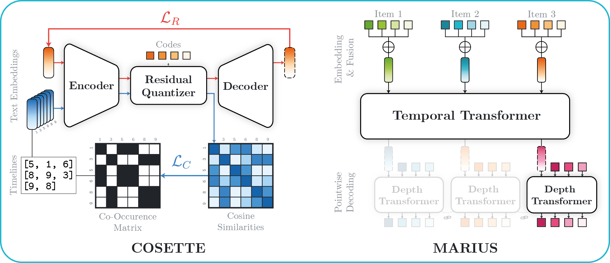

<div align="center">

# COSETTE & MARIUS
Introduced in ***Closing the Performance Gap in Generative Recommenders with Collaborative Tokenization and Efficient Modeling***

<a href="https://simon-lepage.github.io"><strong>Simon Lepage</strong></a>
—
<strong>Jérémie Mary</strong>
—
<a href=https://davidpicard.github.io><strong>David Picard</strong></a>

<a href=https://ailab.criteo.com>CRITEO AI Lab</a>
&
<a href=https://imagine-lab.enpc.fr>ENPC</a>
</div>

<div align="center">
    <a href="https://arxiv.org/abs/2508.14910">
        
    </a>
    </img>
</div>

## Overview

This repository provides the official implementation of COSETTE and MARIUS, introduced in our paper on efficient generative recommendation.

It includes : 
- **Preprocessing scripts** to download and embed the Amazon Reviews 2023 dataset (`data_scripts/`);
- **COSETTE**, for collaborative and semantic tokenization, with its postprocessing;
- **SASRec++**, an improved dense sequential recommendation baseline;
- **MARIUS**, an efficient generative recommender architecture built for scalability and performance.

## Usage

> ⚠️ **Note:** This codebase is built for Ray Train v2. Make sure to enable it with
> ```sh
> export RAY_TRAIN_V2_ENABLED=1
> ```


### Environment

Create a new environment with Python 3.9 and install dependencies:

```sh
pip install -r requirements.txt --extra-index-url https://download.pytorch.org/whl/cu124
```

### Data processing

Run the following scripts (in order) from the `data_scripts/` directory.
Each script can be configured through its associated Hydra config file in `configs/` (e.g., to select a different category).
- `0_raw_to_parquet.py` — Downloads the raw data from the [official Huggingface repository](https://huggingface.co/datasets/McAuley-Lab/Amazon-Reviews-2023) and converts it to Parquet format.
- `1_make_embeddings.py` — Embeds items using a `sentence-transformers` model. We used [Sentence-T5-XL](https://huggingface.co/sentence-transformers/sentence-t5-xl).
- `2_train_cosette.py` — Trains **COSETTE** to quantize the embeddings.
- `3_remove_collisions.py` — Applies the deduplication procedure on the generated tokenization, taking centroids distance into account. 
    - You will need to override `data.quant_method` in the configuration, as the name is dynamically generated for each COSETTE training.

### Training

This repository includes implementations for **SASRec++** and **MARIUS**. Train a model with: 
```sh
python src/train.py experiment=sasrec # or marius
```
Adjust parameters as needed for your setup (filesystem path, number of CPUs, COSETTE run name, etc). We used *HDFS* for our experiments.

### Testing

Compute validation and test metrics with:
```sh
python src/test.py run_directory=xxx
```
Replace `xxx` with the path to your trained model directory.

## Citation

To cite our work, please use the following BibTeX entry:

```bibtex
@article{lepage2025closing,
  title={Closing the Performance Gap in Generative Recommenders with Collaborative Tokenization and Efficient Modeling},
  author={Lepage, Simon and Mary, Jérémie and Picard, David},
  journal={arXiv:2508.14910},
  year={2025}
}
```