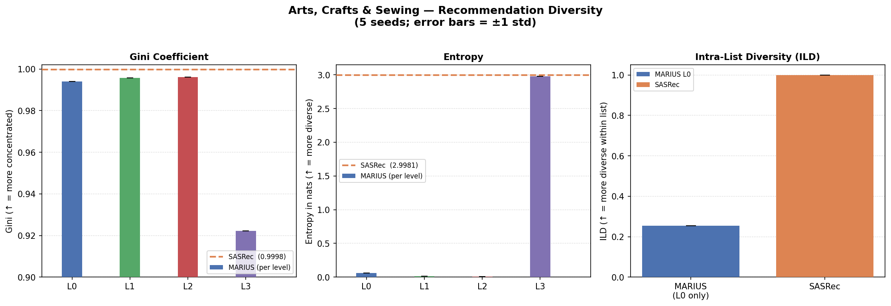
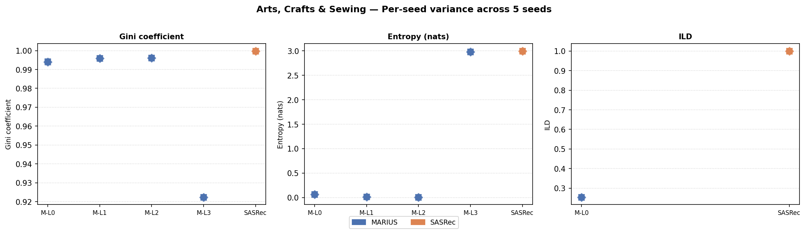

# Arts, Crafts & Sewing — Recommendation Diversity

**Generated:** 2026-06-18 | **Seeds:** 42, 44, 46, 48, 50 | **Test set, real checkpoints**

## Metric definitions

- **Gini** — higher = more concentrated / popularity-skewed recommendations
- **Entropy (nats)** — higher = more diverse / uniform recommendations
- **ILD** — mean pairwise distance within each user's list (binary for SASRec; normalised Hamming for MARIUS L0 only)
- MARIUS Gini/Entropy are per RVQ level (conditioned on preceding levels); ILD is a single list-level value (L0 only)

## Results

| Method | Level | Gini (mean ± std) | Entropy / nats (mean ± std) | ILD (mean ± std) |
|--------|-------|-------------------|----------------------------|------------------|
| MARIUS | L0 | 0.9940 ± 0.0001 | 0.0625 ± 0.0002 | 0.2536 ± 0.0000 |
| MARIUS | L1 | 0.9958 ± 0.0000 | 0.0153 ± 0.0001 | — |
| MARIUS | L2 | 0.9961 ± 0.0000 | 0.0046 ± 0.0001 | — |
| MARIUS | L3 | 0.9223 ± 0.0000 | 2.9801 ± 0.0001 | — |
| SASRec | item | 0.9998 ± 0.0000 | 2.9981 ± 0.0000 | 1.0000 ± 0.0000 |

## Plots

## Key observations

1. **Popularity concentration (Gini):** Both models are heavily concentrated (Gini > 0.92). SASRec is marginally more skewed (0.9998) than MARIUS at every level. MARIUS's L3 level is noticeably less concentrated (0.9223), indicating the final token choice is more spread out.

2. **Entropy collapse in MARIUS:** Entropy drops sharply across RVQ levels — L0: 0.063 → L1: 0.015 → L2: 0.005 — then jumps back to 2.98 at L3. The conditional chain forces early levels to predict very narrow distributions; L3 recovers diversity. SASRec is near maximum entropy at the item level (3.0 nats).

3. **Intra-list diversity (ILD):** SASRec achieves ILD = 1.0 (all recommended items are distinct at the item-ID level). MARIUS L0 ILD is ~0.254, meaning the RVQ token sequences within a user's recommendation list are notably similar to one another.

4. **Seed stability:** Standard deviation is ≤ 0.0002 across all metrics and all seeds — results are highly reproducible.
